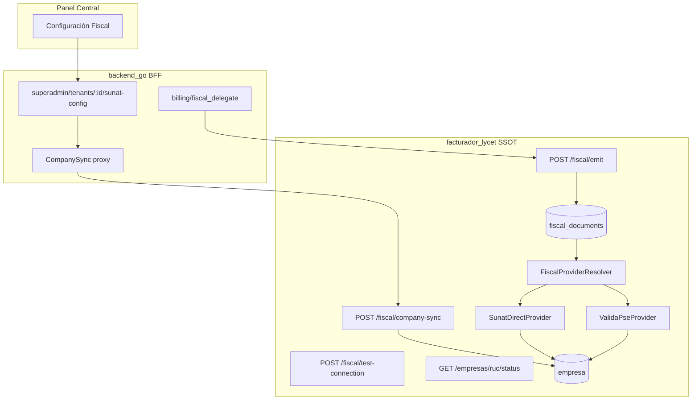

# Arquitectura fiscal multi-tenant V2

## Principios

1. **facturador_lycet (`empresa`)** = único source of truth de credenciales y modo de emisión.
2. **ERP tenant** solo guarda metadatos: `send_mode`, `fiscal_provider`, `connection_status`, `fiscal_last_sync_at`, `sunat_connected`.
3. **Emisión** (`POST /api/v1/fiscal/emit`): solo `tenant_id`, `tenant_slug`, `sale_id`, `ruc`, `document` — sin secretos ni decisiones fiscales.
4. **Decisión SUNAT vs PSE** en `FiscalProviderResolver` según `empresa.send_mode`.

## Diagrama

## Modelo `empresa` (facturador)

| Campo | Uso |
|-------|-----|
| `send_mode` | `sunat_direct` \| `pse` |
| `provider` | `sunat`, `validapse`, `nubefact`, … |
| `connection_type` | `bearer`, `basic_auth`, `custom` |
| `sol_user`, `sol_pass`, `certificate` | SUNAT directa |
| `certificate_password` | Password del .pfx/.pem |
| `pse_base_url` | URL del PSE **por tenant** (no .env global) |
| `pse_token`, `pse_user`, `pse_pass` | Credenciales PSE |
| `pse_secondary_user`, `pse_metadata_json` | Extensión multi-proveedor |
| `connection_status` | `connected`, `invalid_credentials`, … |
| `last_connection_check`, `connection_error` | Estado operativo |

Migración: `facturador_lycet/migrations/Version20260528000000.php`

## API nuevas

| Método | Ruta | Descripción |
|--------|------|-------------|
| POST | `/api/v1/fiscal/company-sync` | Sync completo con validación por modo |
| POST | `/api/v1/fiscal/test-connection` | Prueba real SUNAT/PSE |
| GET | `/api/v1/empresas/{ruc}/status` | Estado sin secretos |
| POST | `/api/superadmin/tenants/:id/fiscal-test-connection` | Proxy BFF |

## Validación por modo

- **SUNAT directa**: `sol_user`, `sol_pass`, certificado (archivo o base64).
- **PSE**: `pse_base_url` + credenciales según `connection_type` (bearer / basic_auth).

No se exige SOL en modo PSE al crear empresa.

## Plan de despliegue

### Etapa 1 — Facturador (esta entrega)
- Migración `Version20260528000000`
- Endpoints company-sync, test-connection, status
- Providers con `pse_base_url` por empresa
- Sin `pse_token` en emit

### Etapa 2 — BFF + tenant metadata
- `SyncFiscalToFacturador` vía company-sync
- Limpieza secretos en `tenant_company_config` tras sync OK
- `fiscal_delegate` sin modo ni tokens

### Etapa 3 — Panel central
- Modal "Configuración Fiscal" dinámico
- Badge `connection_status`, botón probar conexión

### Etapa 4 — Migración datos
- Script: leer secretos legacy en tenants → `POST /fiscal/company-sync` → verificar status

### Etapa 5 — Producción
- Ejecutar migraciones Doctrine en facturador
- Auto-migrate tenants Go (GORM)
- Smoke test por tenant: test-connection + emit de prueba

## Checklist producción

- [ ] `php bin/console doctrine:migrations:migrate` en facturador
- [ ] Variables: `FACTURADOR_BASE_URL`, `FACTURADOR_TOKEN`, `FISCAL_QUEUE_WORKERS`
- [ ] Redis fiscal workers activos
- [ ] Por cada tenant: guardar config fiscal desde panel → status `connected`
- [ ] Emitir boleta/factura de prueba → verificar `fiscal_documents` sin `_meta` en snapshot
- [ ] PSE: confirmar URL en `empresa.pse_base_url` (no `VALIDAPSE_BASE_URL` global)

Ver también: `backend_go/docs/LEGACY-FISCAL-REMOVED.md`

## Archivos principales

| Componente | Path |
|------------|------|
| Entidad SSOT | `facturador_lycet/src/Entity/Empresa.php` |
| Company sync | `facturador_lycet/src/Service/Fiscal/FiscalCompanySyncService.php` |
| Providers | `facturador_lycet/src/Service/Fiscal/Provider/*` |
| BFF sync | `backend_go/internal/company/service/fiscal_sync.go` |
| Emit ERP | `backend_go/internal/billing/service/fiscal_delegate.go` |
| Panel | `frontend_central/src/pages/tenants/TenantsPage.tsx` |
