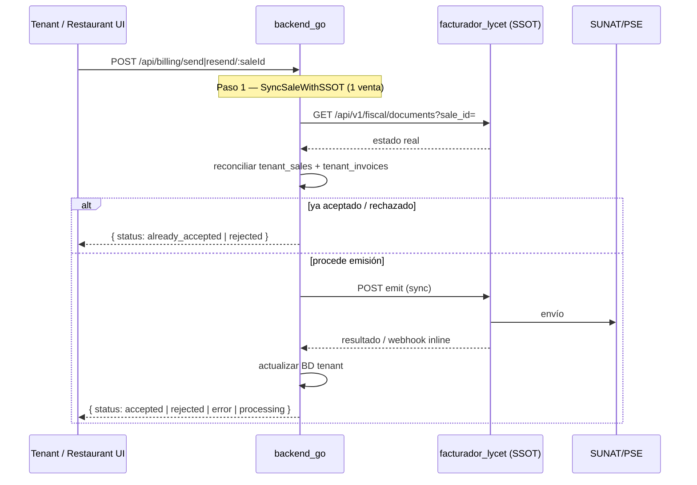
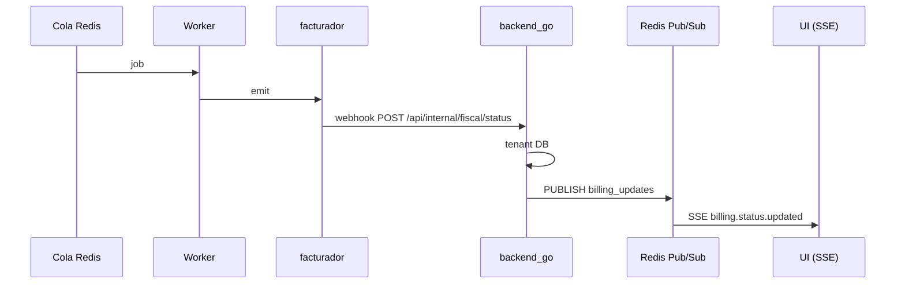

# Arquitectura billing realtime (Manual síncrono + Cola async + SSE)

Sincronización fiscal en SaaS multi-tenant con dos caminos claramente separados.

## 1. Flujo manual (Enviar / Reenviar a SUNAT)

Operación **síncrona** desde la perspectiva del usuario: el endpoint espera el resultado real (timeout ~90s en backend) y responde de inmediato.



### Respuesta unificada (`ManualBillingResult`)

| `status` | Significado |
|----------|-------------|
| `accepted` | Aceptado por SUNAT en esta operación |
| `already_accepted` | SSOT ya tenía aceptación; BD reconciliada |
| `rejected` | Rechazado por SUNAT |
| `error` | Error de emisión/envío |
| `processing` | Entró a cola o SUNAT demora; usar SSE para el resto |

**Regla crítica en reenvío:** siempre `SyncSaleWithSSOT` antes de bloquear o reenviar. Evita UI en `pending` cuando el facturador ya tiene `accepted`.

**Sin polling en frontend** para acciones manuales. El backend puede consultar el SSOT internamente durante la espera (`waitManualCompletion`).

## 2. Flujo automático (cola + background)

Para retries, envío masivo, workers y procesamiento background:



`EnqueueSendToSUNAT` / `EnqueueFiscalEmit` siguen siendo **async** para workers. No se usan en send/resend manual del tenant.

## Componentes

| Capa | Manual | Cola async |
|------|--------|------------|
| **Endpoint** | `POST send/resend` → `ManualSendToSUNAT` / `ManualResendToSUNAT` | Workers / enqueue |
| **SSOT sync** | 1 venta, siempre antes de resend | Reconcile worker (~7 min) |
| **Webhook** | Aplica estado si llega durante wait | Mecanismo principal |
| **SSE** | Solo si `processing` o otras pestañas | Push a UI |
| **Poll frontend** | **No** | **No** |

## Endpoints

### Manual

```http
POST /api/billing/send/:saleId
POST /api/billing/resend/:saleId
```

Respuesta ejemplo:

```json
{
  "status": "already_accepted",
  "message": "El comprobante ya fue aceptado por SUNAT",
  "billing_status": "accepted",
  "safe_to_print": true,
  "success": true,
  "async": false
}
```

### SSE (cola / multi-tab)

```http
GET /api/billing/events?access_token={JWT}
```

### Estado local (diagnóstico)

```http
GET /api/billing/status/:saleId
```

Lee solo BD tenant.

## Reconciliación (fallback silencioso)

Worker: `cron.StartFiscalReconcileWorker()` — batch 100, `pending` > 2 min, solo estados **terminales** en facturador. No reemplaza sync inmediato del flujo manual.

## Frontend

- `useBillingEvents` — SSE para cola y sincronización distribuida
- `manualBilling.ts` — helper toast + badge desde respuesta síncrona
- **Eliminado:** polling en `handleSend` / `handleResend`

## Configuración

```env
REDIS_URL=redis://...
FACTURADOR_BASE_URL=http://facturador:8000
FACTURADOR_TOKEN=...
INTERNAL_API_KEY=...
ERP_WEBHOOK_URL=http://backend:3000/api/internal/fiscal/status
ERP_WEBHOOK_KEY={INTERNAL_API_KEY}
```
