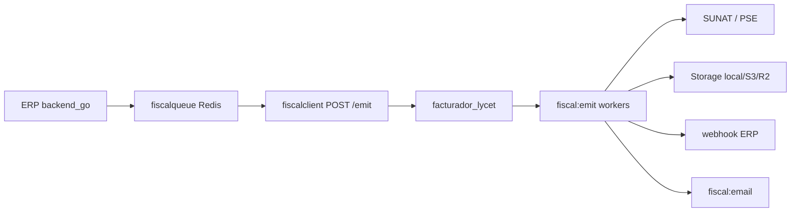

# Operaciones fiscales — Guía técnica

Documentación operativa para staging/producción multi-tenant.

---

## Arquitectura (resumen)



**Source of truth fiscal:** tabla `fiscal_documents` en facturador_lycet.

---

## Flujo SUNAT directo

1. POS crea venta → `POST /api/billing/send/:saleId`
2. ERP encola `tukifac:fiscal:queue` (no bloquea)
3. Worker ERP construye snapshot JSON → `POST /api/v1/fiscal/emit`
4. Facturador: fingerprint + claim Redis → `fiscal:emit`
5. `SunatDirectProvider`: Greenter firma → SUNAT → CDR
6. Storage XML/CDR/PDF → webhook ERP → actualiza `tenant_invoices`

---

## Flujo PSE (ValidaPSE)

1. Mismo encolado ERP con `send_mode=pse` en snapshot
2. `ValidaPseProvider`: Greenter XML **sin firmar** → ValidaPSE → SUNAT
3. Guarda `unsigned_xml_url` + `pse_response_json`
4. Webhook ERP con mismos campos

---

## Flujo webhook ERP

- URL: `POST /api/internal/fiscal/status`
- Headers: `X-Internal-Key`, `X-Fiscal-Signature` (HMAC SHA256), `X-Fiscal-Event-Id`
- Dedup: Redis `tukifac:fiscal:webhook:dedup:{event_id}` (72h)
- Retry facturador: cola `fiscal:webhook_sync` si ERP no responde
- Auditoría facturador: tabla `fiscal_webhook_events`

---

## Flujo retry

| Cola | Uso |
|------|-----|
| `fiscal:retry` | Reintento SUNAT directo (backoff exponencial) |
| `fiscal:pse_retry` | Reintento PSE |
| `fiscal:status_poll` | Consulta ticket resumen/baja |
| `fiscal:webhook_sync` | Reintento webhook ERP |

Máximo 5 reintentos emit por documento (config empresa `retry_enabled`).

---

## Flujo email

1. Tras `accepted` → cola `fiscal:email`
2. Email desde `snapshot_json.customer.email` (inmutable)
3. Symfony Mailer SMTP + adjuntos (local o descarga URL S3/R2)
4. Log en `outbound_email_logs`
5. Retry hasta 5 intentos; email inválido → `invalid` sin retry infinito

---

## Flujo storage

- Driver: `FISCAL_STORAGE_DRIVER=local|s3|r2|minio`
- Path: `{tenant-slug}/sunat/YYYY/MM/{tipo}-{serie}-{numero}.{ext}`
- Descarga dashboard/API: `GET /api/v1/fiscal/documents/{uuid}/download/{type}`
- Tipos: `pdf`, `signed_xml`, `xml`, `cdr`, `unsigned_xml`

---

## Dashboard fiscal

- UI: `GET /login` → sesión → `/dashboard` (usuario `app:admin:seed`)
- API stats (ERP/scripts): `GET /api/v1/fiscal/stats?token=CLIENT_TOKEN`
- API listado: `GET /api/v1/fiscal/documents` (filtros completos)
- API detalle: `GET /api/v1/fiscal/documents/{uuid}` (timeline, attempts, emails, webhooks)

### Acciones API

| Acción | Endpoint |
|--------|----------|
| Reenviar | `POST .../send` |
| Reintentar | `POST .../retry` |
| Forzar | `POST .../force` |
| Reenviar email | `POST .../email` |
| Poll ticket | `POST .../poll` |

---

## Tests automatizados

```bash
# Facturador — idempotencia
php bin/console app:fiscal:stress-test --tenants=100 --per-tenant=5

# Facturador — carga multi-tenant encolado
php bin/console app:fiscal:load-test --tenants=100 --docs-per-tenant=2 --dup-factor=3

# ERP — cola concurrente 100 tenants
go test ./pkg/fiscalqueue/ -run ConcurrentEnqueue100Tenants -v

# ERP — dedup webhook + UBL disabled
go test ./pkg/fiscaldedup/... ./internal/billing/service/ -run 'Fiscal|UBL|Disabled' -count=1
```

---

## Troubleshooting

### SUNAT caída / timeout

- Documento → `retrying` → cola `fiscal:retry`
- Ver `fiscal_emit_attempts` y dashboard timeline
- Tras 5 fallos → `error`; reenvío manual desde dashboard

### PSE timeout / credenciales

- Ver `pse_response_json` en detalle documento
- Token PSE en empresa facturador (`pse_pass`) y snapshot `_meta.pse_token`
- Cola `fiscal:pse_retry`

### Worker crash

- Documentos quedan `queued`/`sending` en BD
- Reiniciar: `php bin/console app:fiscal:worker`
- Reenviar manual: `POST .../send`

### Redis restart

- Colas en memoria perdidas → jobs no procesados
- Documentos en BD persisten → reencolar desde dashboard
- Webhook dedup ERP: fallback in-memory single-node (usar Redis en prod)

### SMTP fail

- `outbound_email_logs.status=failed`
- Retry automático cola `fiscal:email`
- Reenvío: `POST .../email`

### Storage unavailable

- Emit falla en `FiscalEmitProcessor` → retry
- Verificar credenciales S3/R2 y `FISCAL_S3_PUBLIC_URL`

### Tenant bleed (aislamiento)

- Verificar `tenant_slug` en snapshot y webhook payload
- Storage path incluye `{tenant-slug}/`
- Redis keys incluyen fingerprint con `tenant_id`
- Webhook ERP valida `tenant_id` vs slug central

---

## Migraciones pendientes

```bash
php bin/console doctrine:migrations:migrate
# Incluye Version20260525000000 (webhook audit + indexes)
```

---

## Referencias

- [FISCAL-COMMANDS-AND-CRON.md](./FISCAL-COMMANDS-AND-CRON.md) — **workers, colas y comandos (cómo correr en prod)**
- [ARQUITECTURA-FISCAL.md](./ARQUITECTURA-FISCAL.md)
- [STAGING-FISCAL-CHECKLIST.md](./STAGING-FISCAL-CHECKLIST.md)
- [REPORTE-FINAL-FISCAL.md](./REPORTE-FINAL-FISCAL.md)
- [LEGACY-ERP-ROADMAP.md](./LEGACY-ERP-ROADMAP.md)
