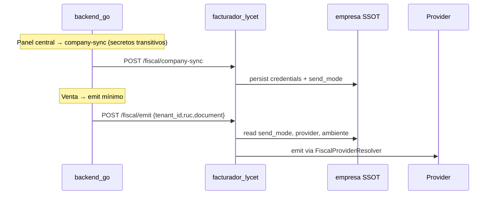

# Legacy Fiscal Removed — Reporte final

**Fecha:** 2026-05-23  
**Objetivo:** arquitectura fiscal única, sin coexistencia de modelos antiguos ni compatibilidad backward en runtime.

---

## Resumen ejecutivo

| Capa | Antes | Ahora |
|------|-------|-------|
| **ERP emit** | Payload con `send_mode`, `provider`, `sunat_mode`, `_meta`, tokens | `tenant_id` + `tenant_slug` + `sale_id` + `ruc` + `document` |
| **Tenant DB** | Secretos SOL/PSE/Tukifac + `invoicing_mode` | Solo metadatos (`send_mode`, `fiscal_provider`, `connection_status`, …) |
| **Decisión fiscal** | ERP / payload / tenant runtime | `facturador_lycet.empresa` (SSOT) en emisión |
| **Feature flag** | `FISCAL_DECOUPLED` | Eliminado — facturador siempre activo si `FACTURADOR_*` configurado |

---

## Archivos eliminados (backend_go)

| Archivo | Motivo |
|---------|--------|
| `internal/billing/service/config_service.go` | `InvoicingConfigService` legacy |
| `internal/billing/service/legacy_adapter.go` | Adaptador Tukifac/PSE dual |
| `internal/billing/service/fiscal_mode.go` | Switch modo fiscal en ERP |
| `internal/billing/service/fiscal_mode_test.go` | Tests del switch eliminado |

## Funciones / rutas eliminadas

| Componente | Eliminado |
|------------|-----------|
| `BillingService.sendToTukifac()` | Emisión HTTP legacy Tukifac |
| `BillingService.EmitFiscalDecoupled()` | Alias de compatibilidad |
| `CompanyService.SaveSunatConfig()` | Persistía secretos en tenant |
| `CompanyService.GetInvoicingSettings()` | Leía `invoicing_mode` |
| `CompanyService.SetInvoicingMode()` | Cambio modo desde ERP |
| `facturador.MapInvoicingModeToSendMode()` | Bridge `legacy_backend` → `sunat_direct` |
| `POST /api/superadmin/tenants/:id/pse/sync` | Sync PSE desde token tenant |
| `TenantHandler.SyncTenantPSECredentialsAPI` | Handler del endpoint anterior |

## Config / env eliminados

| Variable | Estado |
|----------|--------|
| `FISCAL_DECOUPLED` | Eliminada de `config.Config` y `.env*` |
| `LEGACY_INVOICE_ENDPOINT` | Eliminada de `config.Config` y `.env.production.example` |

## Columnas tenant DB eliminadas (migración v039)

Migración: `pkg/database/tenantmigrations/v039_fiscal_legacy_cleanup.go`

- `sunat_sol_user`
- `sunat_sol_pass`
- `sunat_certificate`
- `invoicing_mode`
- `pse_base_url`
- `pse_token`
- `pse_config_json`
- `tukifac_token`

## Struct `TenantCompanyConfig` — campos removidos

Removidos de `pkg/database/migrations.go`: `SunatSOLUser`, `SunatSOLPass`, `SunatCertificate`, `InvoicingMode`, `PSEBaseURL`, `PSEToken`, `PSEConfigJSON`, `TukifacToken`.

Campos fiscales restantes en ERP (metadatos únicamente):

- `send_mode`, `fiscal_provider`, `fiscal_connection_type`, `fiscal_connection_status`, `fiscal_last_sync_at`, `sunat_connected`, `sunat_enabled`, `sunat_env_mode`

---

## facturador_lycet (PHP)

### Comportamiento emit

| Eliminado del payload ERP | Resolución |
|---------------------------|------------|
| `send_mode` | `empresa.send_mode` en `FiscalEmitProcessor` / `FiscalProviderResolver` |
| `provider` | `empresa.provider` |
| `sunat_mode` | `empresa.ambiente` → `beta` / `production` |
| `snapshot._meta` | Stripped en enqueue; nunca persistido |
| `pse_token` en emit | Nunca aceptado |

Payload emit aceptado:

```json
{
  "tenant_id": 1,
  "tenant_slug": "demo",
  "sale_id": 42,
  "ruc": "20123456789",
  "document": { "tipoDoc": "03", "serie": "B001", ... }
}
```

### Archivos modificados

- `FiscalDocumentService.php` — payload mínimo, strip `_meta`, sin setear modo desde ERP
- `FiscalEmitProcessor.php` — aplica `send_mode` / `provider` / `sunat_mode` desde `empresa`
- `FiscalProviderResolver.php` — siempre SSOT empresa (no fallback doc)
- `FiscalCompanySyncService.php` — sin mapeo `legacy_backend`
- `EmpresasService.php` — sin mapeo `legacy_backend`

### Migración datos

- `migrations/Version20260529000000.php` — normaliza `send_mode=legacy_backend` → `sunat_direct`

---

## frontend_central

- Eliminado `invoicing_mode`, `legacy_backend`, `resolveSendMode()` dual
- Tipos `SunatConfigResponse` / `SunatConfigUpdate` sin campos deprecated
- Estado conexión desde facturador SSOT (`pse_*_configured`, `sol_configured`, …)

## frontend_tenant

- `GET /api/company/invoicing` → `send_mode` + `fiscal_enabled` (sin `invoicing_mode`)
- `BillingPage` usa `send_mode` en lugar de `legacy_backend`

---

## Flujo production-ready final



---

## Verificación post-deploy

1. `go build ./...` en `backend_go`
2. `npm run build` en `frontend_central` y `frontend_tenant`
3. `php bin/console doctrine:migrations:migrate` en facturador (incl. `Version20260529000000`)
4. Auto-migrate tenants ERP (v039)
5. Grep cero resultados en código fuente (excl. docs históricos):
   - `legacy_backend`, `invoicing_mode`, `FISCAL_DECOUPLED`, `MapInvoicingMode`, `SyncTenantPSE`
6. Smoke: panel central → guardar config fiscal → test-connection → emit venta → documento en cola sin `_meta`

---

## Documentación actualizada

- `docs/ARQUITECTURA-FISCAL-V2.md` — sin sección compatibilidad legacy
- `docs/LEGACY-FISCAL-REMOVED.md` — este reporte

## Nota sobre docs históricos

Los archivos `FISCAL-COMMANDS-AND-CRON.md`, `STAGING-FISCAL-CHECKLIST.md`, `LEGACY-ERP-ROADMAP.md`, etc. pueden contener referencias obsoletas a `FISCAL_DECOUPLED`; no forman parte del runtime.
